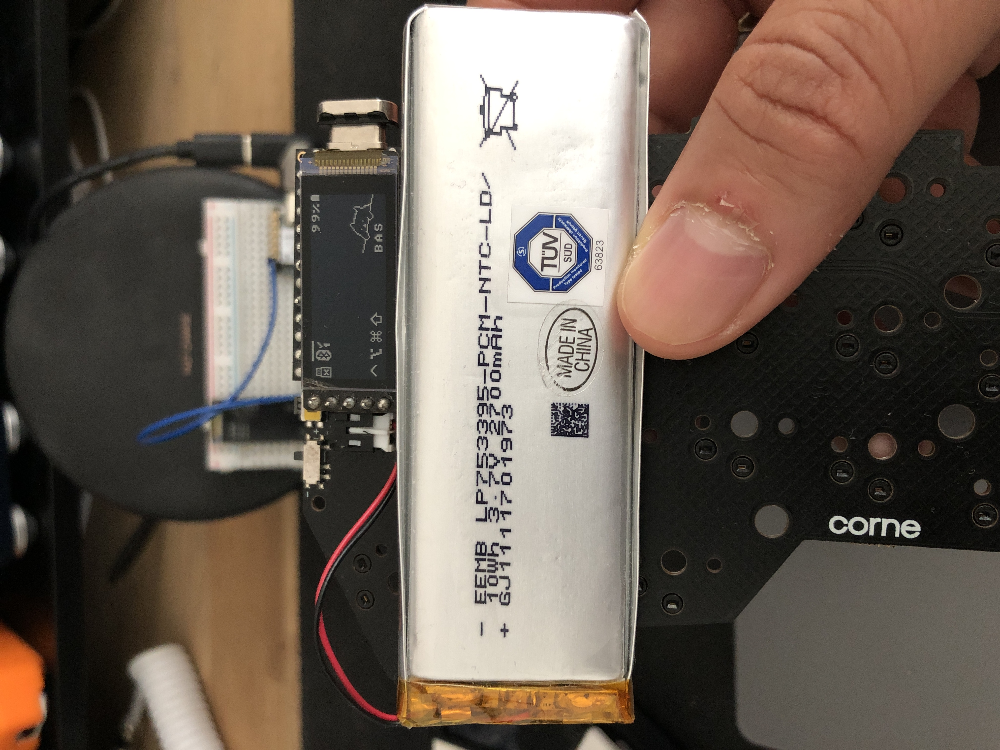

# dongle_display!view
This is a mix between display_dongle by @englmaxi and
[nice!view](https://nicekeyboards.com/nice-view) that allows you to use the
nice!view display with your dongle.

You can find the original version in his [zmk-dongle-display](https://github.com/englmaxi/zmk-dongle-display).

Compatible with all boards with pro micro and seeeduino xiao BLE pinout, like
the Nice!Nano, Puchi, clones and others.

Shields supported:
- dongle_display_view_pro_micro
- dongle_display_view_seeeduino_xiao_ble

[](https://github.com/mctechnology17/zmk-config)
[](https://github.com/mctechnology17/zmk-config)

# Usage
> [!IMPORTANT]
> Keep in mind that you have to have a dongle configured beforehand! Example: [zmk-config](https://github.com/mctechnology17/zmk-config)

- **Example1 using a board with pro_micro pins:**
  ```bash
  west build -b nice_nano_v2 -- -DSHIELD="corne_dongle_pro_micro nice_view_adapter dongle_display_view_pro_micro"
  ```

- **Example2 using a board with pro_micro pins:**
  ```bash
  west build -b puchi_ble_v1 -- -DSHIELD="corne_dongle_pro_micro nice_view_adapter dongle_display_view_pro_micro"
  ```

- **Example3 using a board with seeeduino_xiao_ble pins:**
  ```bash
  west build -b seeeduino_xiao_ble -- -DSHIELD="corne_dongle_xiao nice_view_adapter dongle_display_view_seeeduino_xiao_ble"
  ```

# Configuration
> [!IMPORTANT]
> You can find the original version in his [zmk-dongle-display](https://github.com/englmaxi/zmk-dongle-display).

To also display the battery level of the dongle/central device, use the following configuration property:

```ini
CONFIG_ZMK_DONGLE_DISPLAY_DONGLE_BATTERY=y
```

If you want to use MacOS modifier symbols instead of the Windows modifier symbols, use the following configuration property:

```ini
CONFIG_ZMK_DONGLE_DISPLAY_MAC_MODIFIERS=y
```

To use this module, first add it to your `config/west.yml` by adding a new
entry to `remotes` and `projects`:

```yaml
manifest:
  remotes:
    - name: zmkfirmware
      url-base: https://github.com/zmkfirmware
    - name: mctechnology17
      url-base: https://github.com/mctechnology17
  projects:
    - name: zmk
      remote: zmkfirmware
      revision: main
      import: app/west.yml
    - name: zmk-dongle-display-view
      remote: mctechnology17
      revision: main
  self:
    path: config
```

Now simply indicate in the board and the shield in the `build.yaml` file:

```yaml
---
include:
  - board: nice_nano_v2
    shield: corne_dongle_pro_micro nice_view_adapter dongle_display_view_pro_micro"
  - board: puchi_ble_v1
    shield: corne_dongle_pro_micro nice_view_adapter dongle_display_view_pro_micro"
  - board: seeeduino_xiao_ble
    shield: corne_dongle_xiao nice_view_adapter dongle_display_view_seeeduino_xiao_ble"
```
